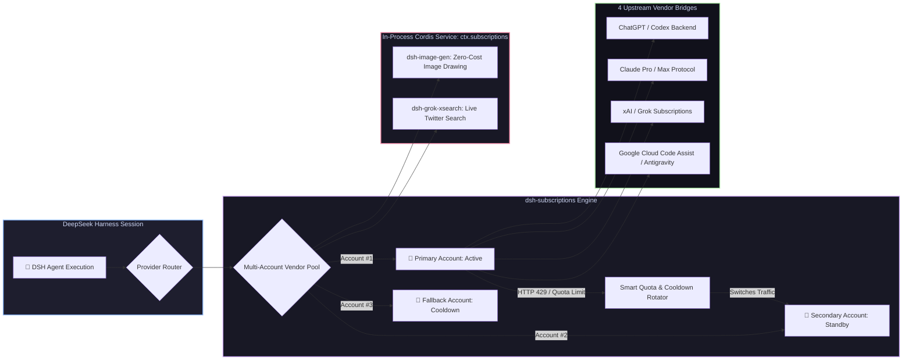

# 📦 @goodandready/dsh-subscriptions

<div align="center">

<h3>Personal AI Subscription Bridge, Multi-Account Pool Rotation & Zero-Leak OAuth for DeepSeek Harness</h3>

<p align="center">
  <a href="https://www.npmjs.com/package/@goodandready/dsh-subscriptions"></a>
  <a href="LICENSE"></a>
  <a href="https://github.com/topics/dsh-plugin"></a>
  <a href="https://nodejs.org"></a>
</p>

<p align="center">
  <a href="https://goodandready.app/"></a>
</p>

<p align="center">
  <a href="README.md"><b>🇬🇧 English</b></a> •
  <a href="README.ru.md"><b>🇷🇺 Русский</b></a> •
  <a href="README.zh.md"><b>🇨🇳 中文说明</b></a>
</p>

</div>

---

## ⚡ Overview

**`dsh-subscriptions`** bridges your paid personal AI subscriptions directly into **DeepSeek Harness** as first-class LLM providers.

Instead of burning expensive pay-as-you-go API credits for everyday agent tasks, `dsh-subscriptions` allows you to authenticate your existing web subscriptions via standard OAuth PKCE. It features **multi-account rotation pools** (automatically switching accounts when a rate limit or cooldown is reached), **preemptive quota switching**, and an **in-process Cordis service (`ctx.subscriptions`)** that safely powers sibling plugins like [`dsh-image-gen`](https://github.com/GooDAnDReaDY/dsh-image-gen) and [`dsh-grok-xsearch`](https://github.com/GooDAnDReaDY/dsh-grok-xsearch) with zero token leakage.



---

## ✨ Key Features & Capabilities

### 1. 🌐 4 Supported Built-in Subscription Vendors

| Vendor Key | Subscription Tier | Protocol & Features |
|---|---|---|
| `codex` | ChatGPT Plus / Pro | Codex streaming responses, tool calling & image drawing (`/backend-api/codex/...`) |
| `claude` | Claude Pro / Max | Native Claude Messages protocol, usage tracking (`/v1/messages`, `/api/oauth/...`) |
| `grok` | xAI / X Premium | Real-time reasoning responses, billing checks & social search |
| `antigravity` | Google Cloud Code Assist | Antigravity engine (`/v1/loadCodeAssist`, `/v1/streamGenerateContent`) |

*Custom vendors can also be dynamically registered via the `createVendorFromProfile` factory.*

---

### 2. 🔄 Multi-Account Rotation & Rate-Limit Mitigation (`rotate.js`, `ratelimit.js`)
* **Multi-Account Pooling**: Attach multiple accounts per vendor (e.g. `CODEX_OAUTH_1`, `CODEX_OAUTH_2`, `CODEX_OAUTH_3`).
* **Automatic 429 Failover**: When an account encounters a rate limit (`HTTP 429`, `RATE_LIMIT`, `QUOTA_EXCEEDED`), traffic instantly fails over to the next healthy account in the pool.
* **Preemptive Quota Switching (`switchAtRemaining`)**: Automatically rotates to the next account before hitting zero if the rate-limit window reset is imminent.
* **Dynamic Cooldown Calculation**: Parses upstream headers (`Retry-After`, `x-ratelimit-reset`, ISO dates, epoch timestamps) and auto-restores cooled-down accounts when their window resets.

---

### 3. 🔒 Zero-Leak Credential Security & Headless OAuth
* **Zero Token Leakage**: OAuth tokens are **never** returned over HTTP API endpoints or rendered in the Web UI. The UI only receives masked account labels, connection health, and quota bars.
* **Secure Host Storage**: Tokens reside in encrypted `$DSH_HOME/.credentials.yaml` managed by the host credentials service.
* **Headless / Remote Login Fallback**: If running DSH on a headless server over SSH where browser popups cannot redirect to `localhost`, simply paste the redirected callback URL or authorization code directly into the account card.
* **Proactive Background Token Refresh**: Access tokens are refreshed automatically before expiration.

---

### 4. 🧩 In-Process Cordis Service (`ctx.subscriptions`)
Sibling plugins can tap into subscription capabilities directly in memory via Cordis:
```javascript
// Example in dsh-image-gen or custom plugins:
const res = await ctx.subscriptions.request('codex', '/backend-api/codex/images/generations', {
  method: 'POST',
  body: JSON.stringify({ prompt: 'Cyberpunk landscape', size: '1024x1024' }),
})
```
* **Zero Overhead**: Eliminates intermediate HTTP loops and keeps auth tokens strictly in-memory.
* **Strict Path Allowlist (`ALLOWLIST`)**: Restricts calls to verified vendor endpoints, preventing SSRF vulnerabilities.

---

## 📦 Quick Installation

```bash
dsh plugin --profile web add @goodandready/dsh-subscriptions
```

> [!IMPORTANT]
> Restart DSH Web UI after installation (`systemctl --user restart dsh-web`) and navigate to **Settings → Subscriptions** to link your accounts.

---

## ⚙️ Configuration Reference (`settings.yaml`)

```yaml
dsh-subscriptions:
  switchAtRemaining: 1
  cooldownMs: 60000
  accounts:
    codex:
      - ref: CODEX_OAUTH_1
        label: "Work Pro Account"
      - ref: CODEX_OAUTH_2
        label: "Personal Plus Account"
    claude:
      - ref: CLAUDE_OAUTH_1
        label: "Claude Max"
    grok:
      - ref: GROK_OAUTH_1
        label: "X Premium"
```

---

## 📄 License

MIT © [GooDAnDReaDY](https://github.com/GooDAnDReaDY)
