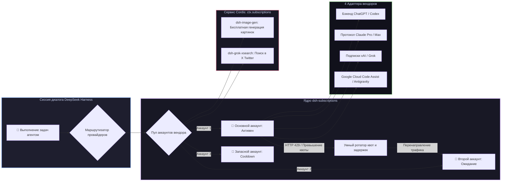

# 📦 @goodandready/dsh-subscriptions

<div align="center">

<h3>Мост персональных подписок на ИИ, ротация пула аккаунтов и безопасный OAuth без утечки токенов для DeepSeek Harness</h3>

<p align="center">
  <a href="https://www.npmjs.com/package/@goodandready/dsh-subscriptions"></a>
  <a href="LICENSE"></a>
  <a href="https://github.com/topics/dsh-plugin"></a>
  <a href="https://nodejs.org"></a>
</p>

<p align="center">
  <a href="https://goodandready.app/"></a>
</p>

<p align="center">
  <a href="README.md"><b>🇬🇧 English</b></a> •
  <a href="README.ru.md"><b>🇷🇺 Русский</b></a> •
  <a href="README.zh.md"><b>🇨🇳 中文说明</b></a>
</p>

</div>

---

## ⚡ Обзор

**`dsh-subscriptions`** подключает ваши платные персональные подписки на нейросети напрямую в **DeepSeek Harness** в качестве полноценных LLM-провайдеров.

Вместо поминутной оплаты дорогих API-ключей для повседневных задач агента, плагин позволяет авторизовать ваши существующие веб-подписки через безопасный протокол OAuth PKCE. Поддерживаются **пулы из нескольких аккаунтов** с автоматической ротацией при исчерпании лимитов, **упреждающее переключение квот** и **внутрипроцессный сервис Cordis (`ctx.subscriptions`)**, который питает соседние плагины (например, [`dsh-image-gen`](https://github.com/GooDAnDReaDY/dsh-image-gen) и [`dsh-grok-xsearch`](https://github.com/GooDAnDReaDY/dsh-grok-xsearch)) без утечки токенов в сеть.



---

## ✨ Ключевые возможности

### 1. 🌐 4 Поддерживаемых встроенных вендора подписок

| Ключ вендора | Тариф подписки | Протокол и возможности |
|---|---|---|
| `codex` | ChatGPT Plus / Pro | Стриминг Codex, вызов инструментов и генерация картинок (`/backend-api/codex/...`) |
| `claude` | Claude Pro / Max | Нативный протокол Claude Messages, трекинг расхода (`/v1/messages`, `/api/oauth/...`) |
| `grok` | xAI / X Premium | Ответы с рассуждениями, проверка баланса и поиск в соцсети |
| `antigravity` | Google Cloud Code Assist | Движок Antigravity (`/v1/loadCodeAssist`, `/v1/streamGenerateContent`) |

*Также поддерживается регистрация кастомных вендоров через фабрику профилей `createVendorFromProfile`.*

---

### 2. 🔄 Ротация аккаунтов и защита от лимитов (`rotate.js`, `ratelimit.js`)
* **Пулы из нескольких аккаунтов**: привязка нескольких аккаунтов на вендора (`CODEX_OAUTH_1`, `CODEX_OAUTH_2`...).
* **Автоматическое переключение при 429**: при превышении лимита запросов трафик мгновенно переключается на следующий свободный аккаунт.
* **Упреждающее переключение квот (`switchAtRemaining`)**: смена аккаунта до падения в ошибку, если окно сброса близко.
* **Динамический расчёт Cooldown**: парсинг заголовков `Retry-After`, `x-ratelimit-reset`, дат ISO и миллисекундных меток с автоматическим возвратом остывших аккаунтов в строй.

---

### 3. 🔒 Безопасность и авторизация на headless-серверах
* **Нулевая утечка токенов**: токен OAuth **никогда** не отдаётся в браузер или через публичный HTTP API. В интерфейсе видны только статус, имя и остаток квоты.
* **Хранилище хоста**: токены шифруются в `$DSH_HOME/.credentials.yaml`.
* **Вход без браузера (SSH / Remote)**: если сервер запущен удалённо, авторизацию можно завершить, просто вставив итоговый redirect URL или authorization code в карточку аккаунта.
* **Фоновое продление токенов**: плагин автоматически обновляет токены до истечения их срока действия.

---

### 4. 🧩 Внутрипроцессный сервис Cordis (`ctx.subscriptions`)
Другие плагины могут использовать подключенные подписки напрямую в памяти:
```javascript
// Пример вызова из dsh-image-gen:
const res = await ctx.subscriptions.request('codex', '/backend-api/codex/images/generations', {
  method: 'POST',
  body: JSON.stringify({ prompt: 'Cyberpunk landscape', size: '1024x1024' }),
})
```
* **Нулевой оверхед**: прямое общение без лишних HTTP-запросов.
* **Белый список путей (`ALLOWLIST`)**: строгий контроль вызываемых эндпоинтов для защиты от SSRF.

---

## 📦 Быстрая установка

```bash
dsh plugin --profile web add @goodandready/dsh-subscriptions
```

---

## ⚙️ Пример конфигурации (`settings.yaml`)

```yaml
dsh-subscriptions:
  switchAtRemaining: 1
  cooldownMs: 60000
  accounts:
    codex:
      - ref: CODEX_OAUTH_1
        label: "Рабочий Pro-аккаунт"
      - ref: CODEX_OAUTH_2
        label: "Личный Plus-аккаунт"
    claude:
      - ref: CLAUDE_OAUTH_1
        label: "Claude Max"
    grok:
      - ref: GROK_OAUTH_1
        label: "X Premium"
```

---

## 📄 Лицензия

MIT © [GooDAnDReaDY](https://github.com/GooDAnDReaDY)
