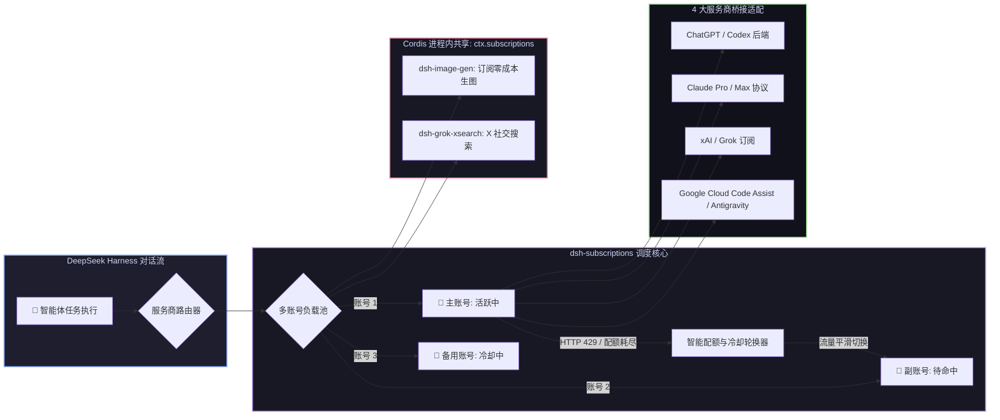

# 📦 @goodandready/dsh-subscriptions

<div align="center">

<h3>DeepSeek Harness 个人 AI 订阅桥接、多账号池轮换与零泄漏 OAuth 插件</h3>

<p align="center">
  <a href="https://www.npmjs.com/package/@goodandready/dsh-subscriptions"></a>
  <a href="LICENSE"></a>
  <a href="https://github.com/topics/dsh-plugin"></a>
  <a href="https://nodejs.org"></a>
</p>

<p align="center">
  <a href="https://goodandready.app/"></a>
</p>

<p align="center">
  <a href="README.md"><b>🇬🇧 English</b></a> •
  <a href="README.ru.md"><b>🇷🇺 Русский</b></a> •
  <a href="README.zh.md"><b>🇨🇳 中文说明</b></a>
</p>

</div>

---

## ⚡ 插件概览

**`dsh-subscriptions`** 将您现有的付费个人 AI 订阅无缝接入 **DeepSeek Harness**，作为第一类模型服务商。

无需为日常智能体任务支付昂贵的 API 按量计费。本插件支持标准 OAuth PKCE 鉴权、**单服务商多账号池动态轮换**（遭遇 429 限流时自动秒切可用账号）、**前置配额平滑切换**，并通过**进程内 Cordis 服务 (`ctx.subscriptions`)** 赋能 [`dsh-image-gen`](https://github.com/GooDAnDReaDY/dsh-image-gen) 与 [`dsh-grok-xsearch`](https://github.com/GooDAnDReaDY/dsh-grok-xsearch) 等插件，实现 Token 零网络泄漏。



---

## 📦 安装指南

```bash
dsh plugin --profile web add @goodandready/dsh-subscriptions
```

---

## 📄 开源协议

MIT © [GooDAnDReaDY](https://github.com/GooDAnDReaDY)
